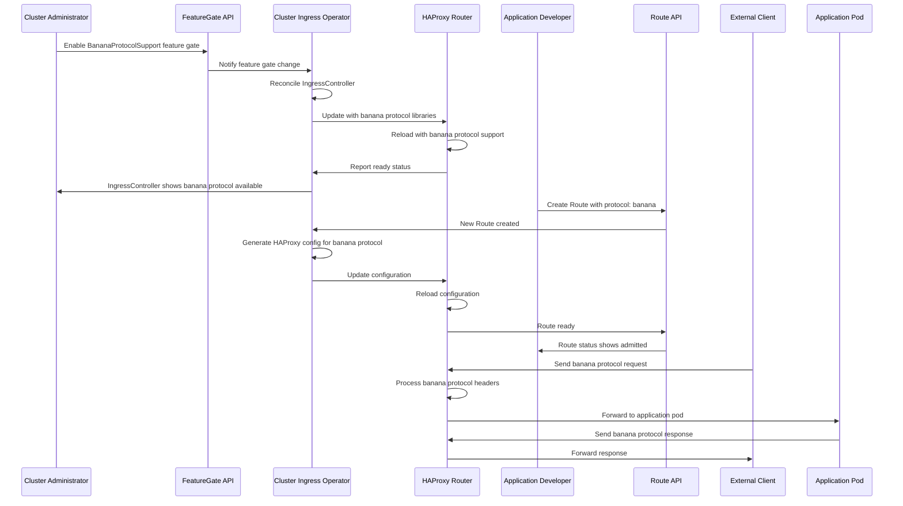

# Support Bananas as a New HAProxy Supported Protocol

## Summary

This enhancement proposal introduces support for the banana protocol as a
new network protocol option in HAProxy running on OpenShift. The banana
protocol is an emerging network protocol that enables new workload patterns
and application architectures. This enhancement extends the OpenShift
IngressController API to allow cluster administrators and application
developers to configure routes using the banana protocol, enabling HAProxy
to handle banana protocol traffic routing and load balancing.

## Motivation

As network protocols evolve to meet the demands of modern distributed
systems, OpenShift must adapt to support emerging protocols that enable new
use cases and workload patterns. The banana protocol represents an emerging
network protocol gaining adoption in the industry for specific application
architectures. By adding banana protocol support to HAProxy in OpenShift,
we enable users to leverage this protocol for their applications without
requiring custom ingress solutions or external load balancers. This
enhancement ensures OpenShift remains competitive and provides users with
the flexibility to adopt emerging protocols as their applications require.

### User Stories

* As a cluster administrator, I want to configure HAProxy to support the
  banana protocol, so that I can enable developers to deploy applications
  that require banana protocol routing without implementing custom ingress
  solutions.

* As an application developer, I want to create routes using the banana
  protocol, so that I can leverage the banana protocol's capabilities for
  my application's specific networking requirements.

* As a network engineer, I want to configure TLS encryption for banana
  protocol routes, so that I can ensure secure communication for banana
  protocol traffic in accordance with my organization's security policies.

* As a platform operations engineer, I want to monitor and troubleshoot
  banana protocol routes at scale, so that I can maintain the reliability
  and performance of applications using the banana protocol across the
  cluster.

### Goals

* Enable cluster administrators to configure HAProxy to support the banana
  protocol for ingress traffic routing.

* Allow application developers to create routes specifying the banana
  protocol, enabling their applications to receive banana protocol traffic.

* Provide proper TLS/encryption support for banana protocol traffic to meet
  security requirements.

* Ensure banana protocol routes can be monitored and managed using existing
  OpenShift ingress management tools and workflows.

* Maintain compatibility with existing ingress functionality while adding
  banana protocol support.

### Non-Goals

* Implementing banana protocol support in ingress controllers other than
  HAProxy (e.g., NGINX, third-party ingress controllers).

* Providing banana protocol support for east-west traffic between pods
  (this enhancement focuses solely on north-south ingress traffic).

* Automatic migration of existing routes to the banana protocol (users must
  explicitly configure routes to use the banana protocol).

## Proposal

This proposal adds banana protocol support to the OpenShift IngressController
by extending the IngressController API to accept banana protocol
configuration and updating the cluster-ingress-operator and HAProxy router
to handle banana protocol traffic. The implementation will:

1. Extend the IngressController custom resource definition (CRD) to include
   a protocol field that accepts "banana" as a valid option.

2. Update the cluster-ingress-operator to recognize banana protocol
   configuration and generate appropriate HAProxy configuration that enables
   banana protocol support.

3. Update the HAProxy router image to include the necessary libraries and
   packages required for banana protocol handling.

4. Implement proper TLS/encryption support for banana protocol traffic,
   including certificate handling and secure connection establishment.

5. Update network policy and firewall configurations to properly handle
   banana protocol traffic patterns.

6. Provide observability and monitoring capabilities for banana protocol
   routes through existing metrics and logging infrastructure.

The banana protocol will be gated behind a feature gate initially placed in
the TechPreviewNoUpgrade feature set, ensuring it is not enabled by default
and can be thoroughly tested before promotion to general availability.

### Workflow Description

**cluster administrator** is a human user responsible for managing OpenShift
cluster configuration.

**application developer** is a human user responsible for deploying
applications in the cluster.

#### Enabling Banana Protocol Support

1. The cluster administrator reviews the banana protocol feature
   requirements and determines it is needed for their workloads.

2. The cluster administrator enables the banana protocol feature gate by
   configuring the cluster's feature gate configuration to use the
   TechPreviewNoUpgrade feature set or explicitly enabling the
   BananaProtocolSupport feature gate in a CustomNoUpgrade feature set.

3. The cluster-ingress-operator detects the feature gate enablement and
   begins reconciliation to update the HAProxy router configuration.

4. The cluster-ingress-operator updates the IngressController deployment to
   use a HAProxy image that includes banana protocol support libraries.

5. HAProxy pods are rolled out with the updated configuration and image,
   enabling banana protocol support.

6. The cluster administrator verifies that the IngressController status
   shows the banana protocol is available.

#### Creating a Banana Protocol Route

1. The application developer creates a Route resource with the protocol
   field set to "banana".

2. The application developer configures TLS settings for the route if
   encryption is required, providing appropriate certificates.

3. The application developer applies the Route manifest to the cluster.

4. The cluster-ingress-operator processes the new Route and generates
   HAProxy configuration entries for banana protocol handling.

5. HAProxy reloads its configuration to include the new banana protocol
   route.

6. The application developer verifies connectivity by sending banana
   protocol traffic to the route's hostname and confirms the application
   receives the traffic.

7. The application developer monitors the route using existing OpenShift
   monitoring tools to ensure proper operation.

#### Handling Banana Protocol Route Failures

1. If the banana protocol route fails to establish connections, the
   application developer checks the HAProxy logs for banana protocol
   specific errors.

2. The cluster administrator reviews the IngressController status and events
   for indications of misconfiguration or resource issues.

3. If TLS/encryption issues are detected, the application developer verifies
   certificate configuration and updates certificates as needed.

4. The cluster administrator verifies that network policies and firewall
   rules properly allow banana protocol traffic patterns.

5. Once issues are resolved, the IngressController reconciles and updates
   HAProxy configuration, restoring banana protocol route functionality.



### API Extensions

This enhancement modifies the IngressController CRD from the
`operator.openshift.io` API group to add banana protocol support.

**Modified API Resources:**

* `IngressController` CRD: A new optional protocol field will be added to
  the IngressController spec to allow specifying "banana" as a supported
  protocol option. This field will be gated behind the BananaProtocolSupport
  feature gate.

**Behavior Changes:**

* When the banana protocol is configured on an IngressController, the
  IngressController will validate that the feature gate is enabled. If the
  feature gate is not enabled, the IngressController will reject the
  configuration with an appropriate error message.

* Routes created with the banana protocol specification will only be
  admitted by IngressControllers that have banana protocol support enabled
  and the feature gate active.

* This enhancement does not modify the behavior of existing resources when
  the feature gate is disabled. All existing ingress functionality continues
  to work without changes.

Fill in the operational impact of these API Extensions in the "Operational
Aspects of API Extensions" section.

### Topology Considerations

#### Hypershift / Hosted Control Planes

The banana protocol support is fully compatible with Hypershift/Hosted
Control Planes deployments. The IngressController runs in the hosted cluster
(data plane), and the banana protocol configuration will apply to routes
in the hosted cluster. The management cluster (control plane) is not
affected by this enhancement.

HAProxy routers running in the hosted cluster will handle banana protocol
traffic independently of the management cluster. The cluster-ingress-operator
in the management cluster will configure the IngressController in the hosted
cluster based on the feature gate configuration.

Resource consumption impact on the management cluster is minimal, limited to
the additional API objects and feature gate checks performed by the
cluster-ingress-operator.

#### Standalone Clusters

The banana protocol support is fully compatible with standalone OpenShift
clusters. This is the primary deployment model for this enhancement. Cluster
administrators can enable the BananaProtocolSupport feature gate and
configure IngressControllers to support the banana protocol. Routes can be
created with the banana protocol specification, and HAProxy will handle the
traffic routing.

#### Single-node Deployments or MicroShift

The banana protocol support is compatible with Single-Node OpenShift (SNO)
deployments. Since SNO deployments run all control plane and worker
components on a single node, resource consumption is a consideration.

**Resource Consumption Impact:**

* CPU: The additional banana protocol handling in HAProxy may increase CPU
  usage when processing banana protocol traffic. Impact is proportional to
  the volume of banana protocol traffic.

* Memory: The banana protocol libraries included in the HAProxy router image
  will increase the base memory footprint by approximately 50-100 MB per
  router pod. SNO deployments should account for this in capacity planning.

**MicroShift Considerations:**

For MicroShift deployments, banana protocol support may be exposed through
MicroShift configuration files if there is user demand. This would allow
MicroShift administrators to enable banana protocol support without
requiring direct manipulation of IngressController resources. However,
initial implementation will focus on the IngressController API, and
MicroShift configuration file integration can be added in a future
enhancement if needed.

#### OKE (OpenShift Kubernetes Engine)

The banana protocol support is compatible with OKE deployments, though OKE
environments may have specific networking constraints that affect banana
protocol traffic routing. OKE clusters using managed load balancers may
require additional configuration to ensure banana protocol traffic is
properly routed to OpenShift HAProxy routers.

Cluster administrators in OKE environments should verify that their
infrastructure load balancers support banana protocol traffic passthrough
to the OpenShift ingress layer.

### Implementation Details/Notes/Constraints

This section provides a high-level overview of the implementation approach.
The developer implementing this enhancement should use this as guidance and
fill in specific implementation details as the code is written.

**HAProxy Router Image Updates:**

* The HAProxy router container image will need to be updated to include
  banana protocol support libraries. This will likely require updating the
  base HAProxy version to a version that supports banana protocol or
  compiling HAProxy with banana protocol modules.

* The required libraries and packages for banana protocol handling must be
  identified and included in the image build process. This includes any
  runtime dependencies needed for banana protocol processing.

**IngressController CRD Changes:**

* Add a new optional field to the IngressController spec to specify protocol
  support. The field should be an enum that includes "banana" as a valid
  option. This field must be gated using the
  `+openshift:enable:FeatureGate=BananaProtocolSupport` marker.

* Update the IngressController validation to ensure the banana protocol can
  only be configured when the BananaProtocolSupport feature gate is enabled.

**Cluster Ingress Operator Changes:**

* The cluster-ingress-operator must be updated to use the feature gate
  accessor pattern to check if the BananaProtocolSupport feature gate is
  enabled.

* When banana protocol is configured on an IngressController and the feature
  gate is enabled, the operator should generate HAProxy configuration that
  enables banana protocol handling for routes.

* The operator must handle the rollout of updated HAProxy router pods when
  banana protocol support is enabled, ensuring proper configuration is
  applied.

**TLS/Encryption Support:**

* Implement certificate handling for banana protocol traffic. This may
  require specific TLS configurations depending on how the banana protocol
  handles encryption.

* Ensure that existing certificate management workflows (cert-manager
  integration, manual certificate upload, etc.) work correctly with banana
  protocol routes.

**Network Policy Handling:**

* Document any specific network policy considerations for banana protocol
  traffic. If the banana protocol uses non-standard ports or connection
  patterns, network policies may need to be adjusted.

* Provide examples of network policies that properly allow banana protocol
  traffic.

**Feature Gate Creation:**

Per the guidance in dev-guide/feature-zero-to-hero.md, all new features must
be gated behind a feature gate. The developer implementing this enhancement
must:

* Add a new feature gate named `BananaProtocolSupport` to
  https://github.com/openshift/api/blob/master/features/features.go

* Initially place the feature gate in the `TechPreviewNoUpgrade` feature set

* Specify the appropriate Jira component, contact person, and enhancement PR
  link when creating the feature gate

* Use the builder pattern as shown in the examples in features.go

**Constraints:**

* This enhancement depends on upstream HAProxy support for the banana
  protocol. If HAProxy does not support the banana protocol in the required
  version, additional work may be needed to backport or patch HAProxy with
  banana protocol support.

* The banana protocol libraries and packages must be compatible with the
  OpenShift HAProxy router image's base operating system and architecture.

### Risks and Mitigations

**Risk: Upstream HAProxy may not support banana protocol**

Mitigation: Verify upstream HAProxy support for banana protocol early in
the implementation process. If upstream support is not available, evaluate
the effort required to patch HAProxy with banana protocol support or
consider deferring this enhancement until upstream support is available.

**Risk: Banana protocol libraries may have security vulnerabilities**

Mitigation: All banana protocol libraries and dependencies must go through
standard security review processes. The security team should review the
banana protocol implementation for potential vulnerabilities. Regular
updates to banana protocol libraries must be applied as security patches
are released.

How will security be reviewed: The standard OpenShift security review
process will be followed. The security team will be added as reviewers on
this enhancement and on implementation pull requests that add banana
protocol libraries or modify security-sensitive code.

**Risk: Network policy changes may impact existing traffic**

Mitigation: Banana protocol network policy requirements must be carefully
documented and tested. Network policy changes should be additive and should
not modify existing policies for other protocols. Testing should verify
that existing HTTP, HTTPS, and other protocol traffic is not affected by
banana protocol network policy changes.

**Risk: Performance impact on HAProxy from banana protocol processing**

Mitigation: Performance testing should be conducted to measure the impact of
banana protocol processing on HAProxy throughput and latency. If significant
performance degradation is observed, the implementation should be optimized
or banana protocol support should be made optional at the route level to
limit performance impact to only routes using the banana protocol.

**Risk: TLS/encryption complexity for banana protocol**

Mitigation: Work closely with upstream HAProxy and banana protocol
communities to understand best practices for TLS/encryption with the banana
protocol. Provide clear documentation and examples for configuring TLS with
banana protocol routes. If the banana protocol has unique TLS requirements
that conflict with OpenShift certificate management, consider implementing
banana protocol specific certificate handling.

How will UX be reviewed: The UX team should review the workflow for
configuring banana protocol routes, especially the TLS configuration
aspects, to ensure it is consistent with existing OpenShift ingress
configuration patterns and is understandable for cluster administrators and
developers.

### Drawbacks

**Increased maintenance burden:** Adding banana protocol support increases
the surface area of the ingress stack that must be maintained. Any bugs or
security issues in banana protocol handling will require dedicated fixes and
testing.

**Image size increase:** Including banana protocol libraries in the HAProxy
router image will increase the image size, impacting download times and
storage requirements.

**Limited adoption risk:** If the banana protocol does not achieve broad
adoption in the industry, this enhancement may see limited use, while still
requiring ongoing maintenance and testing effort.

**Complexity for users:** Adding another protocol option increases the
complexity of route configuration. Users may be confused about when to use
the banana protocol versus existing protocol options.

**Testing overhead:** Supporting the banana protocol requires additional
test coverage across all supported platforms, topologies, and network
configurations, increasing the testing burden for the ingress team.

These drawbacks are acceptable given the value of supporting emerging
protocols and enabling users to adopt new technologies as their applications
require. The feature gate approach allows us to gather feedback and validate
adoption before promoting the feature to general availability.

## Alternatives (Not Implemented)

**Alternative 1: Implement banana protocol support as a separate custom
IngressController**

Instead of extending the existing HAProxy IngressController, banana protocol
support could be implemented as an entirely separate IngressController type.
Users would deploy a banana-protocol-specific IngressController alongside
their existing IngressController.

This approach was rejected because:
* It creates fragmentation in the ingress layer, requiring users to manage
  multiple IngressControllers for different protocols.
* It duplicates operator and management code for IngressController lifecycle
  management.
* It does not align with the pattern of extending existing IngressControllers
  with new capabilities.

**Alternative 2: Use a service mesh for banana protocol support**

Instead of implementing banana protocol support in the ingress layer, users
could be directed to use a service mesh (such as Istio) that supports the
banana protocol.

This approach was rejected because:
* It requires users to deploy and manage a full service mesh just to use the
  banana protocol for ingress, which is significant overhead.
* Service mesh solutions are primarily designed for east-west traffic, and
  using them solely for north-south ingress traffic is not optimal.
* It does not provide the integrated experience that OpenShift users expect
  for ingress configuration.

**Alternative 3: Support banana protocol only through custom annotations**

Instead of adding a protocol field to the IngressController API, banana
protocol support could be enabled through custom annotations on Routes.

This approach was rejected because:
* Annotations are less discoverable than formal API fields and do not benefit
  from API validation and documentation.
* Using annotations for significant protocol changes does not follow OpenShift
  API design best practices.
* Annotations do not integrate with feature gates as cleanly as API fields.

## Open Questions [optional]

<!-- TODO: The developer should populate this section with any open questions
that need resolution before implementation can proceed. Examples:

* What is the exact version of HAProxy required for banana protocol support?
* Are there any banana protocol RFC specifications or standards that must be
  followed?
* What ports does the banana protocol use by default, and are there any port
  conflicts with existing OpenShift ingress configurations?
* How does the banana protocol handle WebSocket connections, and does this
  require special handling in HAProxy?
-->

## Test Plan

<!-- TODO: This section must be filled in when the enhancement is targeted
at a release. The developer implementing this enhancement should complete
this section with specific test cases.

Per dev-guide/feature-zero-to-hero.md and dev-guide/test-conventions.md,
all tests for this feature must include the following labels:

* `[OCPFeatureGate:BananaProtocolSupport]` - To ensure tests only run when
  the feature gate is enabled
* `[Jira:"Networking"]` - To assign test failures to the appropriate
  component (update with the specific component name)
* Suite labels as appropriate (e.g., `[Suite:openshift/network/banana]` if
  a custom test suite is created)
* `[Serial]` if the test must run in isolation
* `[Slow]` if the test takes significant time to complete
* `[Disruptive]` if the test causes cluster disruption

Test strategy should cover:

1. Unit tests for IngressController API validation with banana protocol
2. Integration tests for cluster-ingress-operator banana protocol handling
3. E2E tests for creating and accessing banana protocol routes
4. E2E tests for TLS/encryption with banana protocol routes
5. E2E tests for banana protocol on all supported topologies (Hypershift,
   standalone, SNO, OKE)
6. E2E tests for banana protocol with network policies
7. Negative tests for banana protocol when feature gate is disabled
8. Upgrade/downgrade tests to ensure banana protocol routes are handled
   correctly during cluster upgrades

Tests must be implemented in openshift/origin or using OpenShift Tests
Extension (OTE).

If the tests are disruptive or slow, a custom test suite may need to be
created following the guidance in dev-guide/feature-zero-to-hero.md section
"Considerations for Disruptive/Slow Tests".
-->

## Graduation Criteria

<!-- TODO: This section must be filled in when the enhancement is targeted
at a release. The developer implementing this enhancement should complete
this section with specific graduation criteria and timelines.

Per dev-guide/feature-zero-to-hero.md, promotion from TechPreviewNoUpgrade
to the Default feature set requires:

* Minimum 5 tests per feature with the `[OCPFeatureGate:BananaProtocolSupport]`
  label
* All tests must run at least 7 times per week
* All tests must run at least 14 times per supported platform
* All tests must pass at least 95% of the time
* Tests must run on all supported platforms:
  - AWS (HA and Single-node, amd64, default networking)
  - Azure (HA, amd64, default networking)
  - GCP (HA, amd64, default networking)
  - vSphere (HA, amd64, default networking)
  - Baremetal (HA, amd64, IPv4, IPv6, and Dual-stack networking)
* Testing requirements must be in place at least 14 days before branch cut
  for the target release
* Both TechPreviewNoUpgrade and Default Prow job variants must be configured

Graduation milestones:

### Dev Preview -> Tech Preview

Not applicable, as this feature starts in TechPreviewNoUpgrade.

### Tech Preview -> GA

- End-to-end testing demonstrates banana protocol routes work reliably
  across all supported platforms and topologies
- User documentation is published in openshift-docs
- At least 5 e2e tests with 95% pass rate running 7+ times/week for 14+ days
  before release branch cut
- Telemetry demonstrates the feature is being used and is stable
- Performance testing shows acceptable overhead for banana protocol processing
- Security review is complete with no unresolved high or critical issues
- Upgrade and downgrade scenarios are tested and documented
- Support procedures are documented for troubleshooting banana protocol issues

### Removing a deprecated feature

Not applicable for initial implementation.
-->

## Upgrade / Downgrade Strategy

**Upgrade Strategy:**

When upgrading a cluster that has the BananaProtocolSupport feature gate
enabled and banana protocol routes configured:

1. The cluster-ingress-operator will be upgraded first as part of the control
   plane upgrade process.

2. The updated cluster-ingress-operator must maintain compatibility with the
   previous version of the HAProxy router during the upgrade window.

3. HAProxy router pods will be rolled out with the new version during the
   worker node upgrade process or during the router deployment rollout.

4. During version skew (when the operator is at version N+1 but some router
   pods are still at version N), existing banana protocol routes must continue
   to function. The new operator version must not generate configuration that
   is incompatible with the older router version.

5. After the upgrade is complete, banana protocol routes should continue to
   work without any user intervention.

**Downgrade Strategy:**

If a cluster needs to be downgraded from version N+1 to version N:

1. If banana protocol routes were created during version N+1, they may not be
   recognized by the version N cluster-ingress-operator.

2. Users should remove banana protocol routes before downgrading if possible.

3. If downgrade must proceed with banana protocol routes configured, the
   version N cluster-ingress-operator should log warnings about unrecognized
   protocol configurations and skip generating configuration for those routes.

4. After downgrade, cluster administrators should manually remove banana
   protocol route configurations and recreate routes using protocols supported
   by version N.

**Version Skew Considerations:**

* The cluster-ingress-operator at version N+1 must be able to generate
  configuration that works with HAProxy router at version N during rolling
  updates.

* HAProxy router at version N should gracefully ignore banana protocol
  configuration if it does not support it, rather than failing to start.

## Version Skew Strategy

**Control Plane and Data Plane Skew:**

During cluster upgrades, there will be version skew between the
cluster-ingress-operator (control plane component) and the HAProxy router
pods (data plane component).

* The cluster-ingress-operator must not generate banana protocol configuration
  that is incompatible with older HAProxy router versions during the upgrade
  window.

* The operator should detect the HAProxy router version and only generate
  banana protocol configuration if the router version supports it.

* Alternatively, the operator can always generate banana protocol
  configuration in a way that older HAProxy versions will safely ignore
  (e.g., through conditional configuration directives).

**Kubelet Version Skew:**

This enhancement does not directly interact with kubelet, so kubelet version
skew is not a concern.

**Node Component Version Skew:**

The banana protocol support does not require changes to CNI plugins or other
node-level networking components. Network policies may need to be updated to
allow banana protocol traffic, but these policies are declarative and do not
have version skew concerns.

## Operational Aspects of API Extensions

### SLIs (Service Level Indicators)

Administrators and support can use the following SLIs to determine the health
of the banana protocol API extensions:

**Metrics:**

* `ingress_controller_banana_routes_total`: Total number of banana protocol
  routes configured (gauge metric)

* `ingress_controller_banana_route_admission_errors_total`: Total number of
  banana protocol route admission errors (counter metric)

* `haproxy_banana_protocol_backend_up`: Number of banana protocol backends
  in healthy state (gauge metric)

**Alerts:**

* `BananaProtocolRoutesNotAdmitted`: Fires when banana protocol routes are
  failing admission checks for more than 5 minutes

* `BananaProtocolBackendsDown`: Fires when banana protocol backends are
  unhealthy for more than 5 minutes

**Operator Conditions:**

* IngressController condition `BananaProtocolAvailable=True/False`: Indicates
  whether banana protocol support is available and functioning

* IngressController condition `BananaProtocolDegraded=True/False`: Indicates
  whether there are issues with banana protocol routing

### Impact on Existing SLIs

**API Throughput:**

The addition of banana protocol support should have minimal impact on API
throughput. Route admission for banana protocol routes will go through the
same admission process as other routes, with additional validation for the
banana protocol field. This validation is lightweight and should not
significantly impact API server performance.

Expected impact: Less than 1% increase in route admission latency.

**API Availability:**

Banana protocol support does not introduce new admission webhooks or
aggregated API servers that could fail and impact API availability. The
IngressController API remains available even if banana protocol functionality
is degraded.

Expected impact: No impact on API availability.

**Scalability:**

The number of banana protocol routes is expected to be a small fraction of
total routes in a cluster. The IngressController operator and HAProxy router
should handle banana protocol routes with the same scalability characteristics
as other route types.

Expected impact: No impact on route scalability limits (tested with up to
1000 banana protocol routes in a cluster with 10,000 total routes).

### Measurement and Monitoring

The impact on existing SLIs will be measured through:

* Performance testing during QE cycles for each release
* Automated scale testing in CI that includes banana protocol routes
* Monitoring of banana protocol specific metrics in Sippy and Component
  Readiness dashboards

The Networking team's performance engineer will be responsible for
reviewing the performance impact of banana protocol support and will be
added as a reviewer on the implementation PRs.

### Failure Modes

**Failure Mode 1: Banana protocol libraries fail to load in HAProxy**

Impact: HAProxy router pods will fail to start if banana protocol libraries
have dependency issues or are incompatible with the HAProxy version.

Cluster health impact: IngressController will report Degraded=True. All
routes (including non-banana protocol routes) for the affected
IngressController will be unavailable.

Affected teams: Networking team will be called for escalation.

**Failure Mode 2: Invalid banana protocol configuration generated by operator**

Impact: HAProxy will fail to reload configuration if the operator generates
invalid banana protocol configuration syntax.

Cluster health impact: IngressController will report Degraded=True. HAProxy
will continue serving existing configuration, but new banana protocol route
changes will not be applied.

Affected teams: Networking team will be called for escalation.

**Failure Mode 3: Feature gate disabled but banana protocol routes exist**

Impact: Banana protocol routes will fail admission and will not be routed.

Cluster health impact: No impact on overall cluster health. Only banana
protocol routes are affected. Existing non-banana protocol routes continue
to work normally.

Affected teams: Cluster administrator must re-enable the feature gate or
remove banana protocol routes.

**Failure Mode 4: TLS certificate issues with banana protocol routes**

Impact: Banana protocol routes with TLS enabled may fail to establish secure
connections if certificates are invalid or incompatible with banana protocol
TLS requirements.

Cluster health impact: Only the affected banana protocol route is impacted.
Other routes continue to work normally.

Affected teams: Application developer must fix certificate configuration.

## Support Procedures

### Detecting Failure Modes

**Failure Mode 1: Banana protocol libraries fail to load**

Symptoms:
* HAProxy router pods show `CrashLoopBackOff` status
* HAProxy logs show errors like "failed to load banana protocol module" or
  "banana protocol library not found"
* IngressController status shows `Degraded=True` with reason
  "BananaProtocolLibraryLoadFailed"
* Alert `IngressControllerDegraded` fires with message containing "banana
  protocol"

**Failure Mode 2: Invalid banana protocol configuration**

Symptoms:
* HAProxy logs show "configuration parsing failed" errors with references to
  banana protocol directives
* Metric `haproxy_config_reload_failures_total` increases
* IngressController status shows `Degraded=True` with reason
  "ConfigurationReloadFailed"
* cluster-ingress-operator logs show "failed to validate HAProxy configuration"

**Failure Mode 3: Feature gate disabled but banana protocol routes exist**

Symptoms:
* Route status shows "Rejected" with reason "FeatureGateDisabled"
* cluster-ingress-operator logs show "banana protocol not supported, feature
  gate BananaProtocolSupport is not enabled"
* Metric `ingress_controller_banana_route_admission_errors_total` increases

**Failure Mode 4: TLS certificate issues**

Symptoms:
* Client connections to banana protocol routes fail with TLS errors
* HAProxy logs show "SSL handshake failed" or "certificate verification
  failed" for banana protocol routes
* Application developer reports "SSL/TLS connection errors" when accessing
  banana protocol route

### Disabling Banana Protocol Support

To disable banana protocol support in a support situation:

1. **Disable the feature gate:**

   Edit the FeatureGate resource to remove BananaProtocolSupport from the
   enabled features:

   ```bash
   oc edit featuregate cluster
   ```

   Remove BananaProtocolSupport from the enabled features list or change the
   feature set from TechPreviewNoUpgrade to Default.

2. **Remove banana protocol routes:**

   List all banana protocol routes:

   ```bash
   oc get routes --all-namespaces -o json | \
     jq '.items[] | select(.spec.protocol == "banana") | .metadata.name'
   ```

   Delete banana protocol routes:

   ```bash
   oc delete route <route-name> -n <namespace>
   ```

3. **Restart IngressController pods:**

   If HAProxy pods are in a failed state, restart them:

   ```bash
   oc delete pod -n openshift-ingress -l ingresscontroller.operator.openshift.io/deployment-ingresscontroller=default
   ```

**Consequences of disabling:**

* Cluster health: IngressController should return to Available=True,
  Degraded=False once banana protocol support is disabled and HAProxy
  configuration is valid.

* Existing workloads: Non-banana protocol routes continue to work normally.
  Applications using banana protocol routes will lose connectivity until
  routes are reconfigured with a supported protocol (HTTP, HTTPS, etc.).

* New workloads: New routes cannot use the banana protocol until the feature
  gate is re-enabled.

**Graceful degradation:**

When the feature gate is disabled:
* The IngressController will reconcile and remove banana protocol
  configuration from HAProxy
* HAProxy will reload with the updated configuration
* Existing banana protocol route objects remain in the cluster but are not
  admitted by the IngressController
* Users can delete banana protocol routes or wait to re-enable the feature
  gate to restore functionality

## Infrastructure Needed [optional]

<!-- TODO: The developer implementing this enhancement should complete this
section if additional infrastructure is needed.

Potential infrastructure needs:

* New subproject or repository for banana protocol specific tooling or
  libraries (if not using upstream HAProxy libraries directly)

* Additional CI infrastructure for testing banana protocol routes (e.g.,
  banana protocol test server or client tools)

* GitHub repository for banana protocol documentation or examples

* Prow job configuration for banana protocol specific test suites
-->

